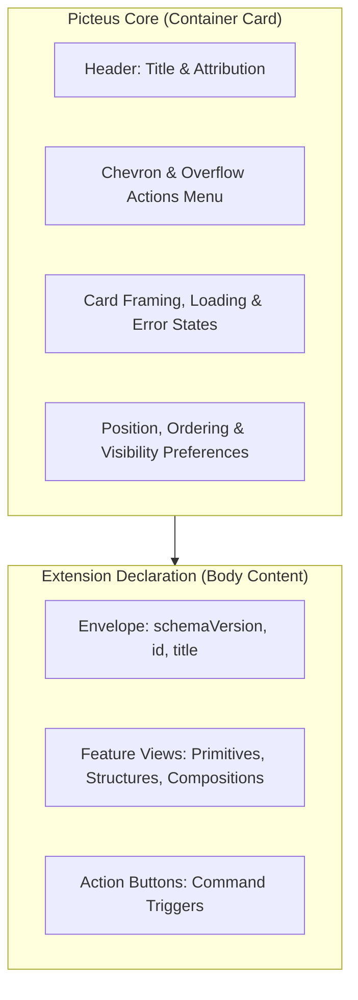

# Picteus Specification Factory

This package contains the formal [TypeSpec](https://typespec.io/) meta-models and cross-platform code generation pipeline for creating **TypeScript**, **Python**, and **React** APIs representing Picteus specifications (such as **Picteus ViewKit** and **Extension Intents**).

The ViewKit grammar models were initially extracted from the visual specimen sheet in Figma.

---

## 1. Architectural model & ownership separation

Feature cards are rendered within a fixed-width **360px inspector side panel**. Visual responsibilities and ownership are divided into two distinct tiers:



1. **Picteus Core owns**:
   - The outer card container framing, margin/padding tokens, and drop-shadow styling ;
   - Card title bar, chevron collapse/expand, and overflow kebab menu ;
   - Attribution badge typography and placement (`extension-id · json`) ;
   - User preferences for feature positioning, ordering, and hiding ;
   - Core lifecycle states: loading skeleton, malformed grammar error fallbacks, and schema version negotiation.

2. **Extension developer declares**:
   - The **Envelope** (`schemaVersion`, `id`, `title`, `description`) ;
   - The ordered sequence of **Feature View Elements** (`elements: UiElement[]`) ;
   - Optional card-level **Action Buttons** (`actions: ActionElement[]`).

---

## 2. Directory structure

All source code is located within `src/` and generated targets in `dist/`:

```
shared/specification-factory/
├── tspconfig.yaml               # TypeSpec project configuration & JSON Schema emitter
├── package.json                 # @picteus/specification-factory package metadata & scripts
├── README.md                    # Specifications documentation
├── dist/
│   ├── schema/
│   │   └── specification-factory.json # Compiled JSON Schema
└── src/
    ├── main.tsp                 # Picteus.FeatureViewGrammar entrypoint & namespace aggregator
    ├── base.tsp                 # Polymorphic base models: @discriminator("type") model UiElement
    ├── envelope.tsp             # @jsonSchema model FeatureBlock (root schema entry point)
    ├── primitives.tsp           # Factorized primitive base models & concrete elements
    ├── modifiers.tsp            # Visual modifiers (copyable, truncate, emphasis, monospace)
    ├── structures.tsp           # Higher-order layouts (LabelValueRow, MultiSlotRow, Table, Groups)
    ├── actions.tsp              # Interactive triggers (Button command invocation, ExternalLink)
    ├── escapeHatches.tsp        # Markdown and HTML fallback blocks
    └── examples.tsp             # Specimen compositions matching the Figma sheet
```

---
