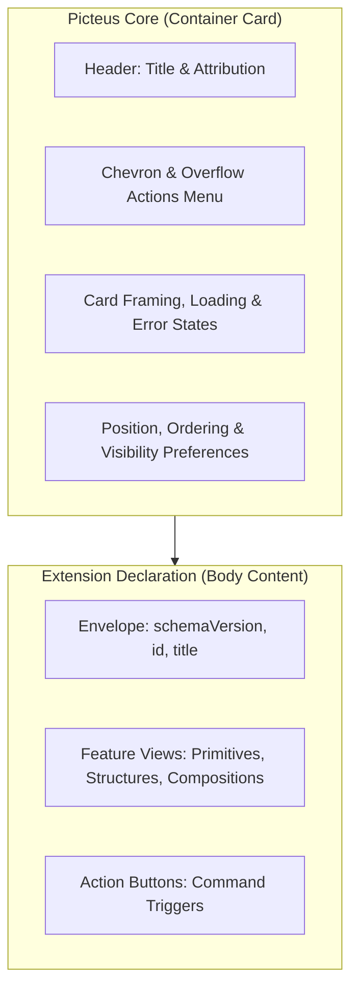

# Picteus Specification Factory

This package contains the formal [TypeSpec](https://typespec.io/) meta-models and cross-platform code generation pipeline for creating **TypeScript**, **Python**, and **React** APIs representing Picteus specifications (such as **Picteus ViewKit** and **Extension Intents**).

The ViewKit grammar models were initially extracted from the visual specimen sheet in Figma.

---

## 1. Architectural model & ownership separation

Feature cards are rendered within a fixed-width **360px inspector side panel**. Visual responsibilities and ownership are divided into two distinct tiers:


```mermaid
graph TD
    subgraph Core["Picteus Core (Container Card)"]
        Title["Header: Title & Attribution"]
        Menu["Chevron & Overflow Actions Menu"]
        Chrome["Card Framing, Loading & Error States"]
        Placement["Position, Ordering & Visibility Preferences"]
    end

    subgraph Extension["Extension Declaration (Body Content)"]
        Envelope["Envelope: schemaVersion, id, title"]
        Elements["Feature Views: Primitives, Structures, Compositions"]
        Actions["Action Buttons: Command Triggers"]
    end

    Core --> Extension
```

1. **Picteus Core owns**:
   - The outer card container framing, margin/padding tokens, and drop-shadow styling ;
   - Card title bar, chevron collapse/expand, and overflow kebab menu ;
   - Attribution badge typography and placement (`extension-id · json`) ;
   - User preferences for feature positioning, ordering, and hiding ;
   - Core lifecycle states: loading skeleton, malformed grammar error fallbacks, and schema version negotiation.

2. **Extension developer declares**:
   - The **Envelope** (`schemaVersion`, `id`, `title`, `description`) ;
   - The ordered sequence of **Feature View Elements** (`elements: UiElement[]`) ;
   - Optional card-level **Action Buttons** (`actions: ActionElement[]`).

---

## 2. Directory structure

TypeSpec specifications and emitter implementations are grouped by feature within `src/`. Shared emitter code remains
directly under `src/emitter/`. Generated ViewKit resources are grouped under `dist/viewkit/`, while Intents resources
remain under `dist/intents/`:

```
dist/
├── viewkit/
│   ├── python/view_kit.py
│   ├── react/ViewKit.tsx
│   ├── schema/viewkit.json
│   └── typescript/viewKit.ts
└── intents/
    ├── python/
    └── typescript/

src/
├── viewkit/
│   ├── index.tsp
│   ├── actions.tsp
│   ├── base.tsp
│   ├── decorators.tsp
│   ├── envelope.tsp
│   ├── escapeHatches.tsp
│   ├── modifiers.tsp
│   ├── primitives.tsp
│   └── structures.tsp
├── intents/
│   └── index.tsp
└── emitter/
    ├── codeWriter.ts
    ├── common.ts
    ├── index.ts
    ├── intents/
    │   ├── decorators.ts
    │   ├── intentsGenerator.ts
    │   └── intentsModel.ts
    └── viewkit/
        ├── codegenModel.ts
        ├── decorators.ts
        ├── pythonGenerator.ts
        ├── reactGenerator.ts
        ├── typescriptGenerator.ts
        └── typespecModel.ts
```

## Intent contract

`src/intents/index.tsp` defines the intent contract in the `Picteus.Intents` namespace. `@frontEndIntent` and
`@backEndIntent` mark intent models for their respective generated unions. The factory emits separate front-end and
back-end TypeScript and Python files, including each union's supporting model definitions.

Run `npm run build:viewkit` or `npm run build:intents` to build and deploy each specification independently.
`npm run build` builds both. The shared core receives the front-end intents; the back-end receives only the back-end
intents; and both extension SDKs receive both files. The front-end imports `FrontIntent` from the shared core and
receives no generated intent file. The `ServeBundleIntent` name is used consistently in both SDKs.

---
